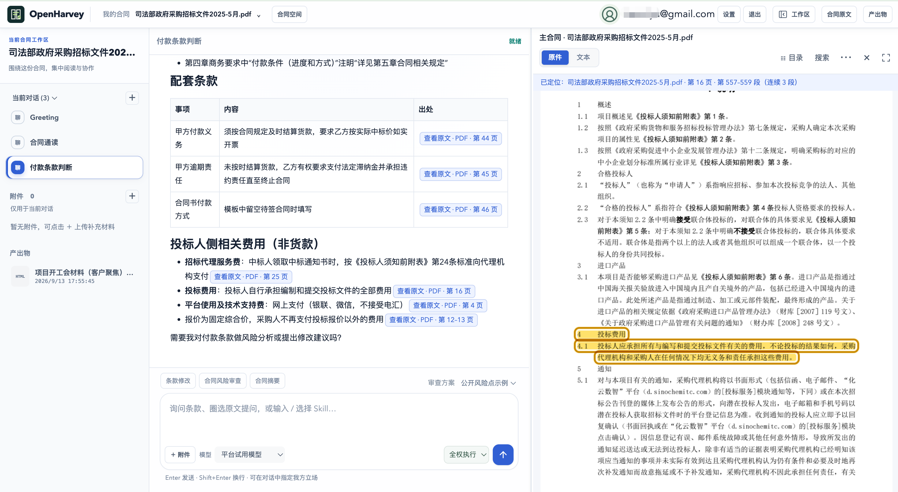
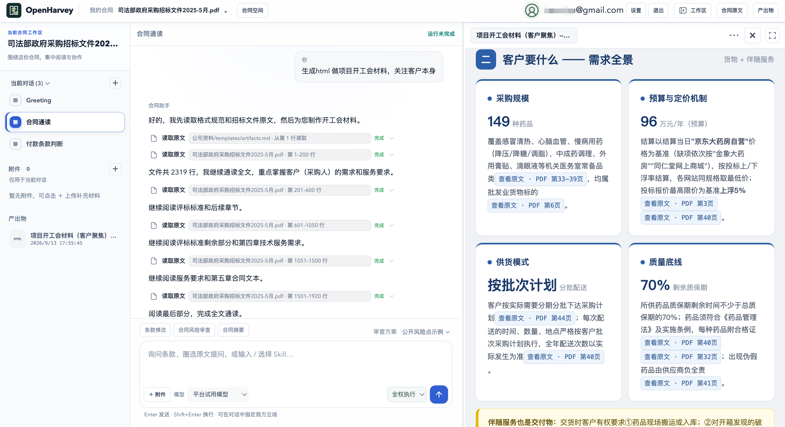
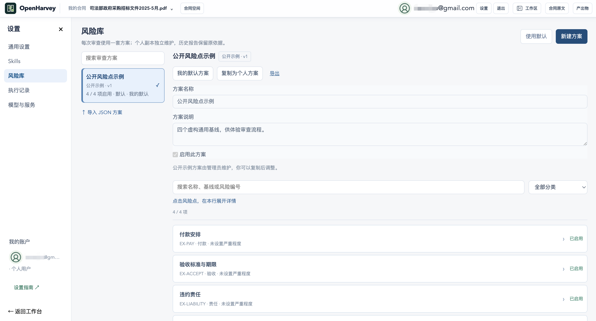
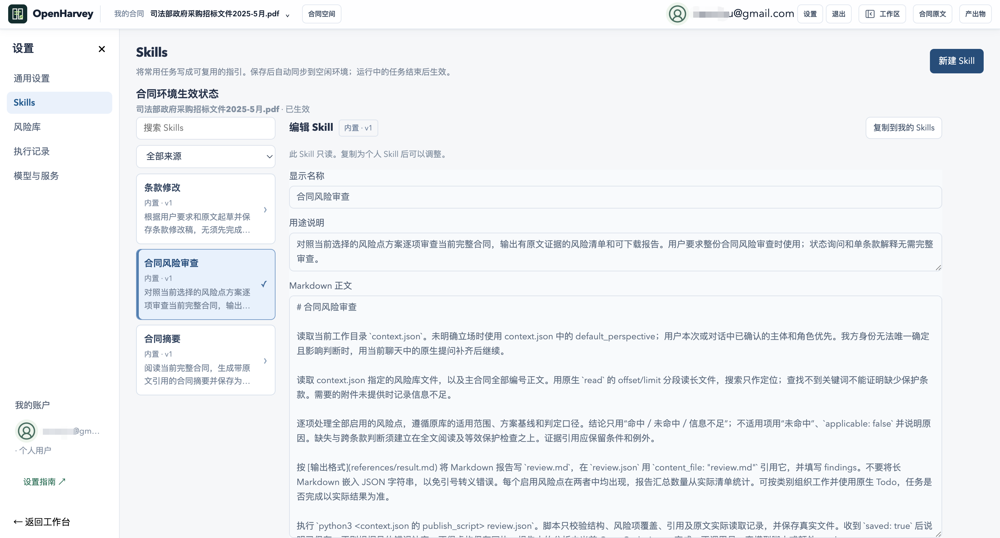
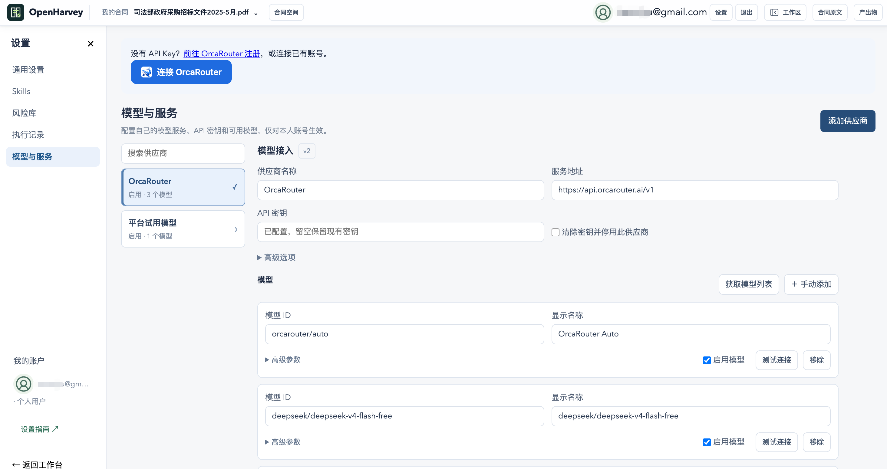

# OpenHarvey

**OpenHarvey（Open Harvey）：面向合同审查与标书工作流的开源 Harvey 替代方案。**

支持原文溯源、自定义风险库与自托管选项。[查看开源 Harvey 替代方案介绍](https://openharvey.com/harvey-alternative)，了解实际工作流、部署与运行费用。OpenHarvey 是独立项目，与 Harvey 无关联，不宣称功能全面对等。

[English](README.md) · [官网](https://openharvey.com) · [在线试用](https://openharvey.com/demo) · [部署说明](docs/deployment.md)

把主合同、附件、对话、风险判断和产出放到同一个工作空间，支持点击有效引用定位原文、连续段落高亮、原文与报告并排核对。

## 核心能力

- 合同空间组织主文档、招投标材料、会话和成果。
- 文档 ID、版本哈希与页码/段落定位共同支撑原文溯源。
- Skills 定义工作方法；风险库定义业务标准；用户可配置模型和立场。
- 支持摘要、风险报告、条款对照及 Markdown、HTML、TXT、JSON、CSV、SVG 等文件交付。部分正式报告生成 Word；HTML 在受限环境内预览。
- OpenCode 原生 Agent 执行工具、管理会话和调用 Skills。
- E2B 云端模式隔离工具执行，应用按用户权限管理材料和文件访问。

首页默认中文，`/en` 为英文官网。工作台界面支持中英文，已有文档、示例和产出保留原有语言；英文合同任务质量需单独验收。

安装命令见 [English README](README.md#quick-start-local-development)。Python 3.12、Node.js 22、OpenCode 1.16.2；数据目录放在代码仓库之外。本地模式适用于可信单用户环境，共享部署应采用隔离运行环境。

## 五大产品亮点

**看得见依据，交得出成果。** [查看完整产品说明与大图](https://openharvey.com/features)。以下为产品实景截图，账号标识已在供图中打码。

### 1. 原文比对与高亮，精准定位出处

回答、报告与原文并排核对。点击有效引用，定位到对应页码与连续段落，高亮相关条款：不止知道结论，还能直接核对依据。

### 2. 产出形式，由任务决定

不局限于固定报告模板。可以要求 Agent 生成项目开工会材料、风险审查报告、合同摘要、条款对照、HTML 看板和结构化清单。已保存成果进入产出物区，支持的格式可直接预览、核对和下载；不是所有文件都逐字实时渲染。

试着这样说：**“基于这份招标文件，生成一份 HTML 项目开工会材料，重点梳理客户需求、交付范围、验收条件和待确认事项，保留原文引用。”**

### 3. 你的风险清单，你的审查立场

内置付款、验收、违约责任、解除与结算四类通用示例风险点。复制为个人方案后，按需增删检查项、调整基线；设置甲方、乙方、采购方、供应商等我方立场。同一份合同，用自己的标准核对，从自己的立场判断。

试着这样说：**“我方是供应商，请按我选择的风险方案审查这份合同，逐项列出原文依据、风险说明和修改建议。”**

### 4. 三大核心 Skills，开箱即用，也能继续扩展

预置 **合同摘要、合同风险审查、条款修改**。复制、调整或新增个人 Skill，把常用任务步骤、参考资料和交付要求写成可复用指引，让 Agent 按你的方法工作。

### 5. 免费试用 + BYOK，不绑定单一模型

托管 demo 默认提供 **10 次任务请求**；注册后总额度默认提升至 **20 次**，包含同一 demo 身份已用次数，不叠加为 30 次。额度按任务请求计数，不等于底层模型调用次数；当前余额和限制以工作台显示为准。

支持 **BYOK（自带 API Key）**：配置自己的服务地址、密钥和模型 ID，接入兼容 OpenAI 接口的模型服务，也可连接 OrcaRouter。实际可用性取决于接口兼容与工具调用能力；模型费用由对应供应商收取，自配模型仍受沙箱资源限制。

截图展示产品界面，不作为审查正确性或任务全部完成的证明。公开风险点为虚构演示标准，不是适用于所有业务的法律判断。

## 数据与开源范围

公开包包含产品源码、公开 Skills、四个虚构风险点、虚构合同样例（不含预生成执行结果）、测试及项目方授权的产品截图。截图所示原始业务文档、账号数据库、凭据、公司内部规则与原开发历史均不随包发布。

Sandbox 不代表零外传。托管模式下，应用服务、E2B 和所选模型服务会按任务处理相关数据。自托管 Web 不自动替代 E2B 和模型服务；部署者需安排备份、访问控制与数据保留策略。

项目使用 AGPL-3.0-only。欢迎提交功能、修复、文档和英语本地化贡献。参见 [贡献指南](CONTRIBUTING.md) 和 [安全说明](SECURITY.md)。

OpenHarvey 是独立项目，与 Harvey AI Corp. 没有关联、授权或赞助关系，不宣称功能完全对等。AI 输出应结合原文与专业判断核对。

## 飞书 / Lark：从企业知识到业务回写

在「连接器」选择飞书或 Lark，通过官方网页创建应用并授权账号，无需手工复制访问令牌。企业应用权限开通、发布和管理员审批仍适用。

- **渠道合同审查**：搜索销售政策，结合合同的直销或渠道属性，对照账期、授权范围和返利条件，返回真实政策来源。
- **投标准备**：结合标书和可访问的产品、交付知识，整理响应要点、差异与澄清清单，按要求保存为协作文档。
- **风险报告与合同台账**：创建报告并返回真实链接；读取多维表格字段后新增或更新明确指定的记录。
- **协作通知**：额外授权通讯录搜索和消息发送后，按用户明确指令查找联系人、以用户身份发送消息。

控制端管理各账号凭证和续期，OpenCode 在 E2B 内通过官方 CLI 直接调用飞书 / Lark；仅访问令牌进入所属沙箱。应用密钥与刷新令牌保留在控制端。飞书文档与台账读写已有真实链路验证；Lark 国际版、消息发送仍需真实账号验收。CRM 专用连接器尚未提供。

[配置、权限及部署说明](docs/feishu-lark.md)
